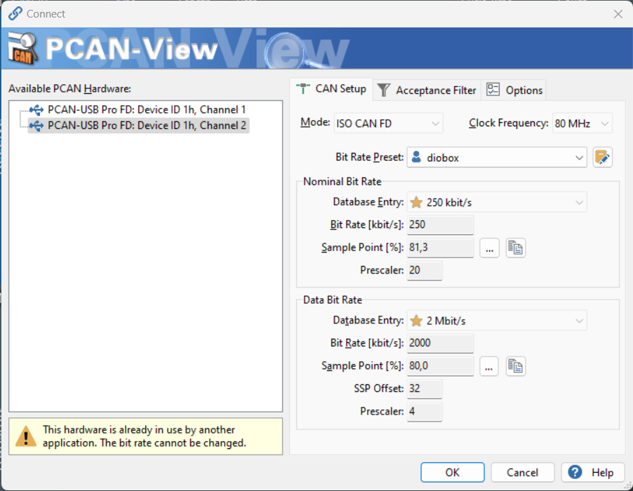

# lan-to-can-bridge

```bash
# install these for the bridge
pip install python-can msgpack uptime

# these for packing
pip install pyinstaller
```

```bash
# build the exe-file
Pyinstaller bridgeapp.py --noconsole --onefile

# run it 
dist/bridgeapp
```

## Config for PCAN viewer 

